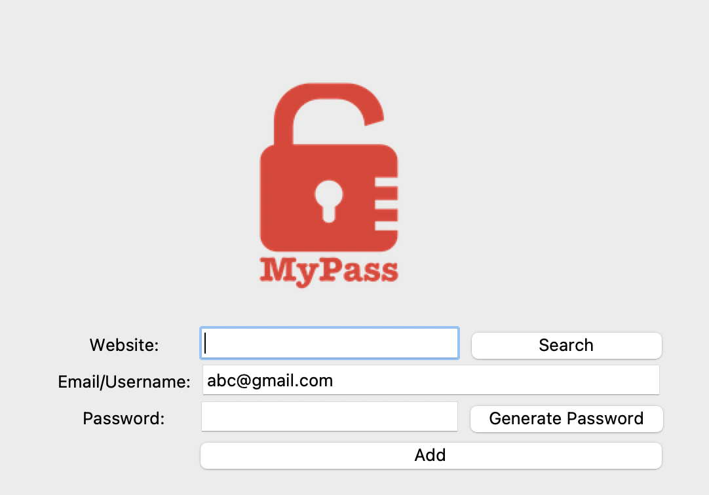

# 🔐 Password Manager with Generator

A simple yet functional Password Manager built using Python and a Tkinter GUI. Users can generate secure random passwords, save their own credentials, and search for saved login information. All data is stored in a local JSON file.

## 🧰 Features

- ✅ **Generate Random Passwords**  
  Instantly create secure, randomized passwords with a single click.

- 📝 **Save Credentials**  
  Store website names, usernames, and passwords to a local JSON file.

- 🔍 **Search Function**  
  Look up saved credentials by website name for easy retrieval.

- 👤 **Custom Password Option**  
  Enter your own password instead of generating one if preferred.
- 🗒️ **Auto-Copies Password**  
Password is automatically copied to the user clipboard for convenience.
- 🧱 **User-Friendly GUI**  
  Built with Tkinter for a clean, intuitive interface.

---

## 📸 Screenshots



---

## 🗃️ Data Storage

All saved credentials are stored in a structured `data.json` file using the following format:

```json
{
  "example.com": {
    "username": "user@example.com",
    "password": "P@ssw0rd123"
  }
}